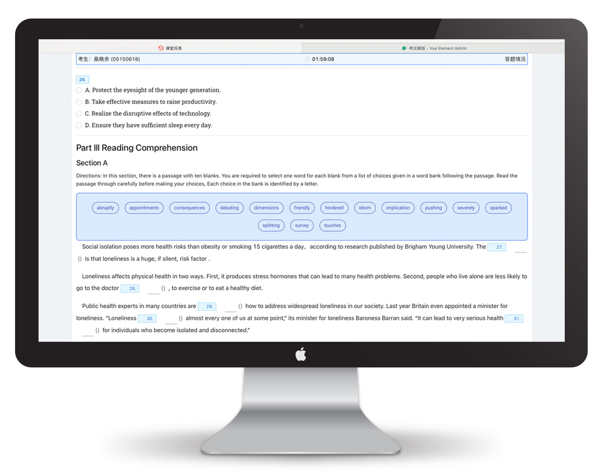
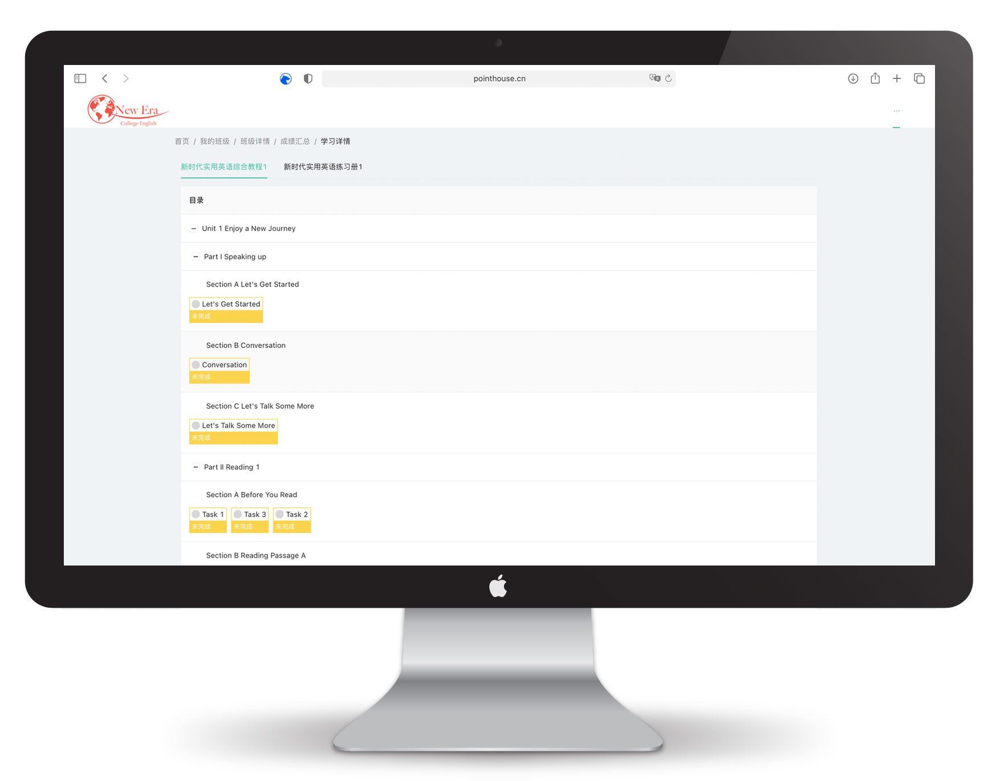
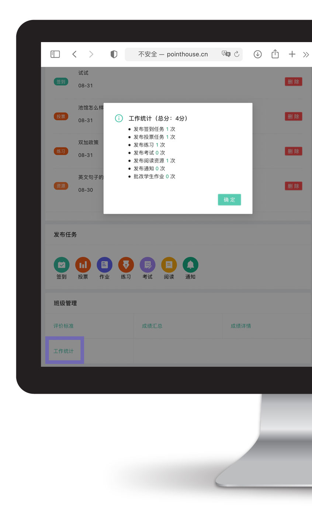

> 教学实践中最核心的功能区域。
> 
> 教师用户对所建立的班级拥有最高权限。
 

## 设立与组建

- 教师用户在「班级」栏目中点击顶部「新建班级」按钮：

 

 

- 细化设置，下拉至「班级管理」，依据教学大纲安排「必学章节」，之后也可随时更改。

- 让学生扫描「班级二维码」，或输入「班级码」，申请入班，老师对照花名册予以审批。同理，学生提出「退班申请」也须教师批准方可生效。

 

 

- 可以将组建好的班级通过底部「其他」功能中的「复制班级」复制成模版，直接在此模版基础上修改，免去二次操作的繁琐。

 

## 签到、通知、投票、作业

- 省去点名繁琐，通过当堂发送签到码即可实现全员签到工作。

 

 

- 发布作业要求、调课通知，且支持弹窗提醒（需在手机「设置」中予以权限）。

 

 

- 「投票」功能会自动保存之前的发布记录，可在不同班级内发送相同投票，也可在模版基础上进行调整。

 

## 题库、无纸化考试 

- 可单独从[题库](/Structure?id=题库)中发布题目，任意数目，任意组合，在班级中发布作为日常练习or课后作业。

- 无纸化考试系统无须另外购买。只需依托后台搭建好的考试模版，即可自动生成试卷。移动端、网页端通用。网页端效果如下：

 

- 教师也可线上监控学生作答情况，查看每道题的答题情况，并且可以主动修改机批分数。

- 自带「倒计时」系统和「切屏」甄别功能，教师可在创建界面设置切屏超过n次将学生踢出考试。

- 目前已建立&即将建立的考试模版（已建立模版均已参考考试大纲调整为最新版本）：
	- [x] PRETCO-A 级
	- [ ] PRETCO-B 级
	- [x] CET-4
	- [ ] CET-6
	- [x] 考研英语一
	- [ ] 考研英语二

## 教学监控

- 可在移动端和网页端随时查看单个学生的学习情况。

 

- 也可对整个班级的学习进度形成顶层把握。

- 在考试模式下，教师可以实时查看学生的答题进度。

## 形成性评估

- 允许教师在「结课」前任意修改评分权重，以便根据教学的实际情况及时调整。

- 可在「班级管理」- 「成绩汇总」（网页端为「成绩详情」）中查看每个学生具体的得分情况。

 

 

- 若需导出为 Excel 格式请在网页端操作。（位于「成绩详情」界面的右上角）

## 工作统计

- 方便教务处以更加直观的方式计算任课教师的工作量，或作为计算参数。

- 仅限网页端查看，操作路径如下：「班级管理」-「工作统计」。

 

