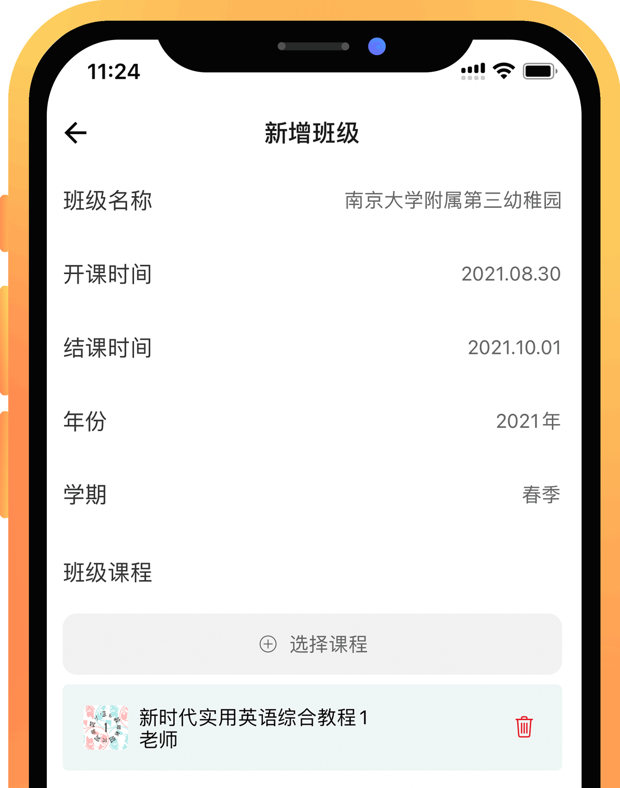
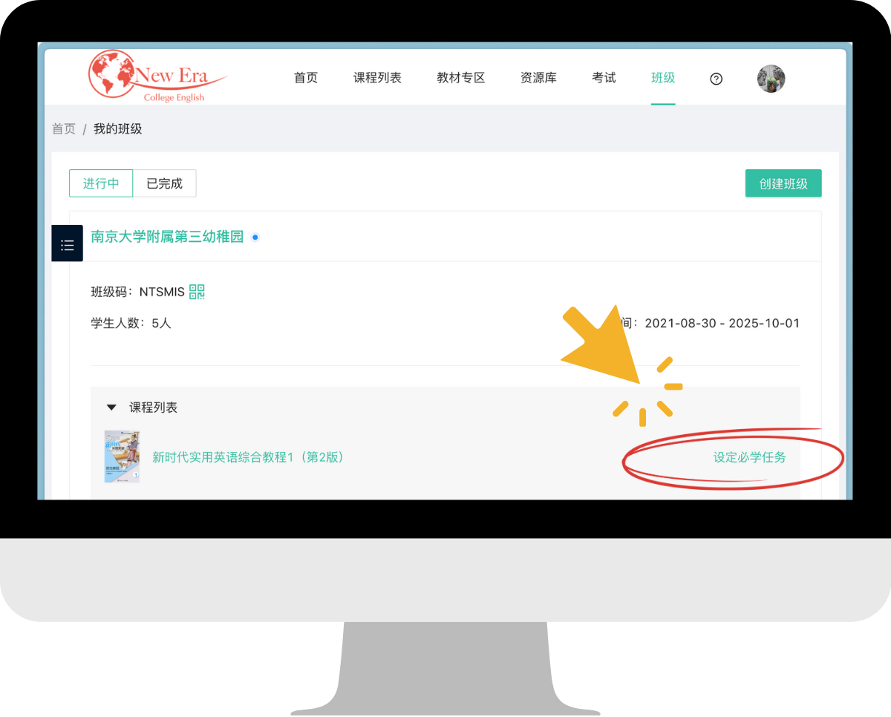
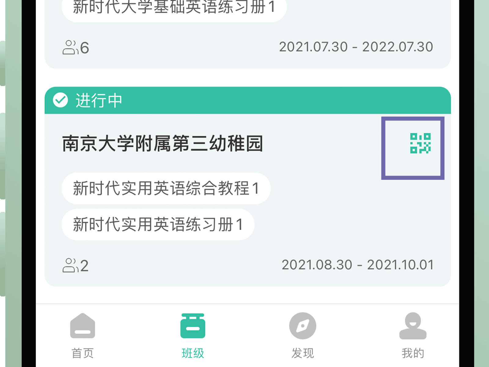
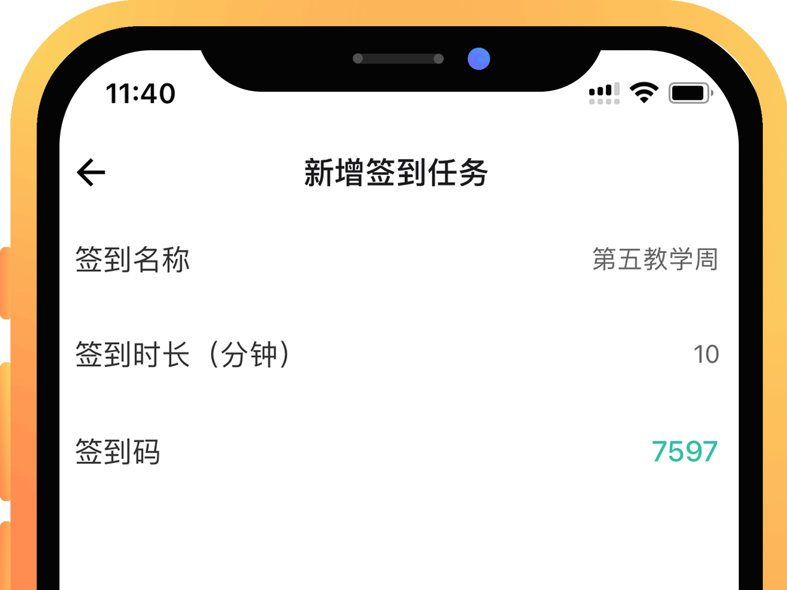
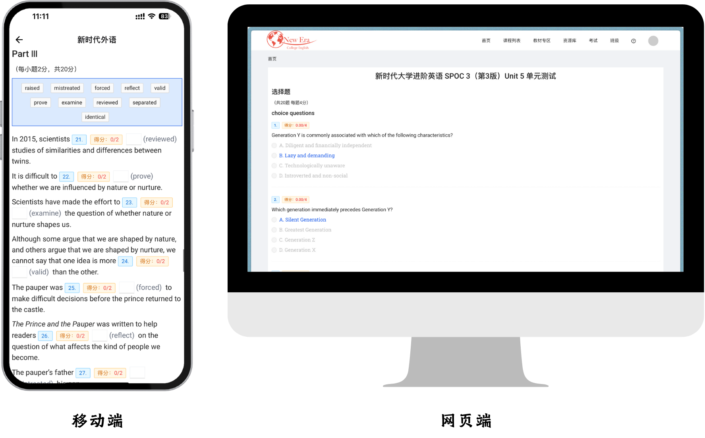
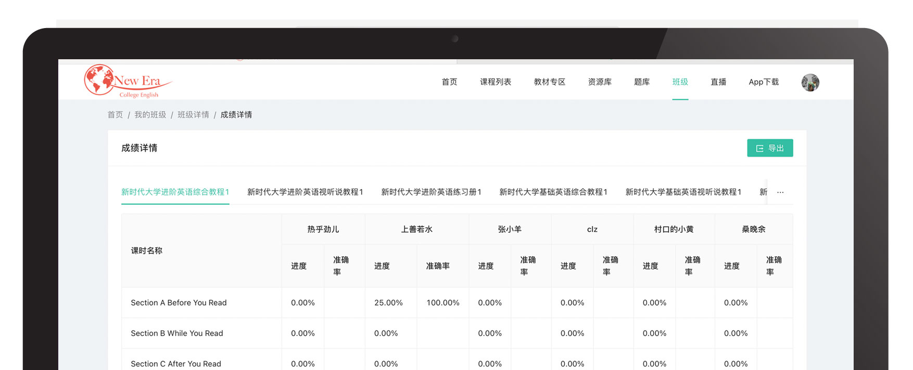
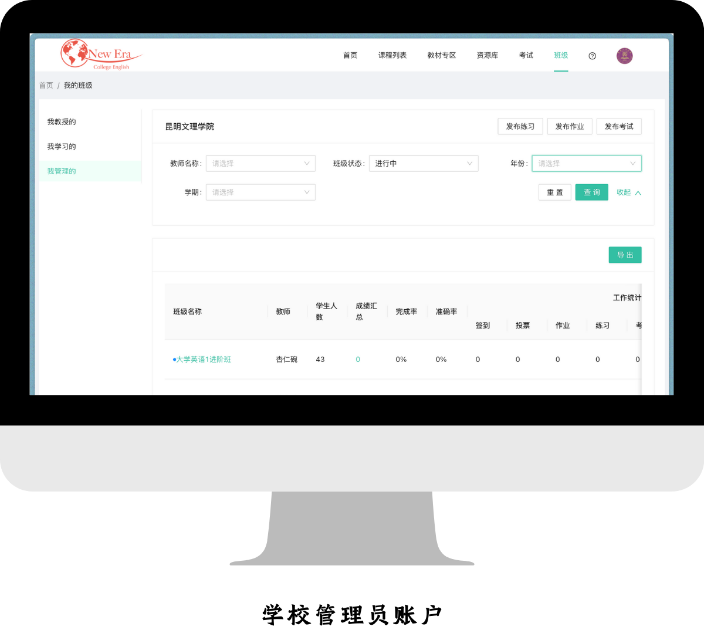

> 教学实践中最核心的功能区域。

## 设立与组建
 

- 教师用户在「班级」栏目中点击顶部「新建班级」按钮：

 

 

- 请谨慎设置开课时间与结课时间。一旦结课（除非教师用户恢复），新的学习数据将不会再更新至成绩明细中。

- 细化设置，下拉至「班级管理」，依据教学大纲安排「必学章节」，可精细到 Task，之后也可随时更改，即时生效。网页端更改必学章节的位置较移动端不同，具体位置如下：

 

- 让学生扫描「班级二维码」，或输入「班级码」，申请入班，老师对照花名册予以审批。同理，学生提出「退班申请」也须教师批准方可生效。

 

 

!> 学生必须[激活](Sign-up?id=激活资源)对应班级设定的教材后，才能入班。

- 可通过底部「其他」功能中的「复制班级」复制本班级的章节设置、评分设置以及班级成员，在此基础上再去微调，适用于同班级新学期开课以及同学期教授多个班级的情况，免去完全重新设置的繁琐。

 

## 签到、通知、投票
 

- 以签到代替点名，通过当堂发送签到码即可实现线上点名。Tip：通过缩短签到时长，可有效限制学生之间的“互帮互助”。

 

 

- 发布任务后，班内学生每次完成，教师用户都会在 站内信 收到系统推送的提示。相应地，学生用户也会在站内信  站内信 中收到班级内的新任务提示。

- 「投票」功能会自动保存之前的发布记录，可在不同班级内发送相同投票，也可在模版基础上进行调整。

!> 「投票」默认为匿名投票，无法查看单个学生的选择。

 

## 作业
 

- 「作业」一般用于发布一次性的开放式任务，如 Writing, Speaking, Presenting 等。

- 发布「写作类型」的作业时，可在「发放设置」中点亮「使用机器批改」，并自主设定关键词汇（防偏题）和字数限制，以及相应权重。最终分数包含三个权重，相加须为100%。参考流程如下：

<i class="ps-icon ps-icon-girl-user"></i>&nbsp;&nbsp;<strong>教师在发放时设置：</strong>

**a.** 机器批改权重 <mark>80%</mark>； 
**b.** 词数要求 140；词数权重 <mark>10%</mark>； 
**c.** 关键词：school、teacher 关键词权重 <mark>10%</mark>； 

<i class="ps-icon ps-icon-cinch"></i>&nbsp;&nbsp;<strong>学生提交作业：</strong>  

**a.** AI给文章语言质量的评分为 **80** 分（满分100分）； 
**b.** 词数 145，达到规定词数，得 **100** 分 ； 
**c.** 文中有 teacher 但未出现 school，扣题率50%，得 **50** 分； 

<i class="ps-icon ps-icon-sign"></i>&nbsp;&nbsp;<strong>该学生最终得分为：</strong>  

**80** × <mark>80%</mark> + **100** × <mark>10%</mark> + **50** × <mark>10%</mark> = **79分**

<i class="ps-icon ps-icon-aim"></i>&nbsp;&nbsp;<strong>教师主动修改：</strong> 

**a.** 教师阅读文章后，认为AI批改过于严格，手动将得分改为 <strong>85</strong> 分； 
**b.** 该学生的最终得分调整为：<strong>85</strong> 分

- 当前版本允许学生以「语音」形式提交作业，也提供智能语音批改，AI的语音评分标准与文本评分标准差异较大，无法识别字数和关键词，仅依据“流畅度”和“准确度”赋分，请谨慎参考。

- 教师用户可在「发放设置」中设置时长限制，目前最长 300 秒。

!> 若不点亮「使用机器批改」，所有学生只要提交内容，均默认满分。

- 教师用户可随时手动赋分，在任务界面下拉，点击学生用户名（已提交作业的会标绿），即可更改具体学生的分数。

 

## 练习
 

- 「练习」 一般用于发布[题库](/Structure?id=题库)和班级选定[教材](Structure?id=数字化教材)中的题目，可选任意数目，任意组合，作为随堂测试或课后作业。

- 支持「题目乱序」，每个学生用户看到的任务中的题目顺序均为随机。

 

## 题库、无纸化考试 
 

- 无纸化考试系统无须另外购买，教师用户可免费使用。移动端、网页端通用。

 

 

- 依托后台搭建好的「模版库」，可自动生成试卷。目前已建立&即将建立的考试模版（已建立模版均已参考考试大纲调整为最新版本）：
	- [x] PRETCO-A 级
	- [ ] PRETCO-B 级
	- [x] 考研英语一
	- [ ] 考研英语二
	- [x] CET-4
	- [ ] CET-6

- 如需使用「试卷库」中的定制试卷，请请联系我社当地业务人员。

- 支持「选项乱序」，开启后，选择题中的选项会被打乱展示。

- 支持「倒计时」和「答题卡总览」功能，学生在考试过程中可随时查看剩余时间以及未答题目。

 

 

- 支持「切屏甄别」功能，教师可在创建界面设置切屏超过n次将学生踢出考试或标记为作弊。

- 试卷中若有主观题（如翻译、写作），可开启「机器自动批改」,批改逻辑与发布「作业」时相同，教师用户也可随时修改，手动赋分。

- 注意，在设定的考试时间内可将学生已提交的试卷「打回」，继续答题，一旦超过考试截止时间，则无法使用此操作，请知晓。

- 如需使用池馆系统进行高利害、大范围考试，请提前联系我社业务人员，以便定制试卷，并做好应急预案。

 

## 教学监控
 

- 可随时查看单个学生的学习情况。方便老师适时进行教学干预。也可就教材内某个具体内容发起班级讨论。

 

 

- 从班级内点进对应教材，可随时查看单个学生的学习情况。方便老师适时进行教学干预。也可就教材内某个具体内容发起班级讨论。

- 也可对整个班级的学习进度形成顶层把握。可在网页端导出为excel表单。

- 在考试模式下，教师可点击每个学生的监考按钮，查看学生的操作记录（如:何时进入考试，何时重新进入，何时提交，切屏次数等）。

 

## 形成性评估
 

- 允许教师在「结课」前任意修改评分权重，以便根据教学的实际情况及时调整。每项还可单独设置「设定范围」（即排除哪些任务，计入哪些任务），可适应各种教学需要。

- 可在「班级管理」- 「成绩汇总」（网页端为「成绩详情」）中查看每个学生具体的得分情况。

 

 

- 若需导出 Excel 格式的成绩汇总请在网页端操作，目前支持对调表格的行和列，来优化显示。（均位于各详情界面的右上角）

 

## 学校管理员
 

- 教务部门若有监管老师线上课程实施情况的需要，请联系当地业务人员，协助开通学校管理员账号。

- 开通后，请从网页端登陆，可查看本校所有班级的运行情况,以及教师的工作统计（发布任务的数量）。

- 支持以学年、学期、教师姓名以及班级状态筛选查看。

- 学校管理员可以统一发布任务、作业、考试，一次发布即可在本校所有教学班级生效。

 

