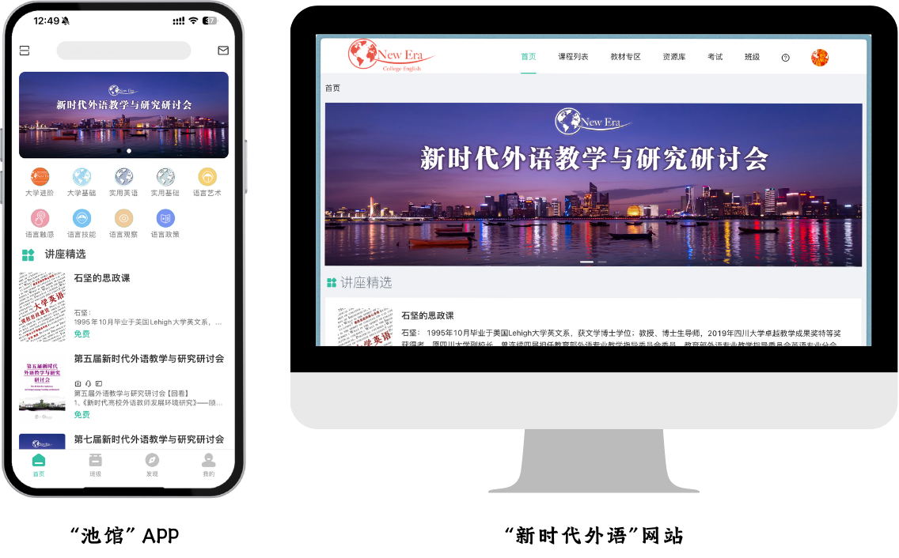

# 手册说明 

!> 在参考本文档前，请确保您设备上的池馆 APP 已更新至 **2.6** 或以上版本。

- 移动端“池馆”APP与网页端“新时代外语”网站是与「新时代大学英语」系列英语教材配套的英语学习平台，功能一致，且账户互通。

 

 

- 本手册旨在同时为上述平台提供帮助文档。
- 可在移动端阅读此手册，若配图随屏幕尺寸收缩过小，单击图片即可自动放大。网页端体验更舒适。
- 若想直接阅读总览版本，请进入：[Overview Page](Overview)
- 每个页面均可通过右上角&nbsp;&nbsp;下载 PDF 版本，储存到本地。
- 配套教材目前有如下品类：[🚪](ISBN.md)

  - 新时代大学进阶英语综合教程（第3版）、视听说教程（第3版）、练习册（第3版）、长篇阅读（第2版）；
  - 新时代大学基础英语综合教程（第2版）、视听说
  教程（第2版）、练习册（第2版）；
  - 新时代实用英语综合教程（第2版）、视听说教程（第2版）、练习册（第2版）；
  - 新时代大学英语综合教程、视听说教程、练习册、长篇阅读；
    - 除练习册和长篇阅读以外，均有对应的教学参考书；
    - 更多教材正在持续开发中…… 🐝

> 在线教育深刻地改变了教师“教”的方式、学生“学”的方式、大学“管”的方式，正在塑造时时、处处、人人皆可学的新教育形态 [...] 尊重当代青年“网络原住民”的认知规律和学习特征，创新学习内容，模式和方法，激发学习兴趣和潜能，彰显“以学习为中心”的教育理念，促进个性化学习。
>
> 
—— 联合国教科文组织教育信息技术研究会《慕课发展北京宣言》2020.12

