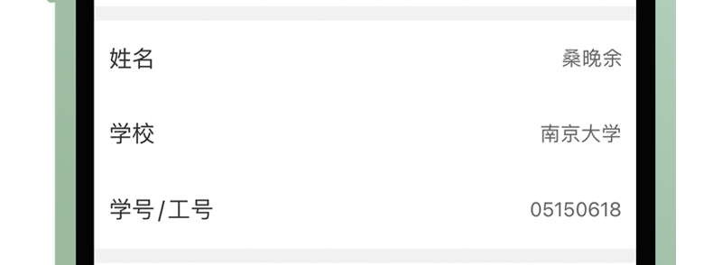
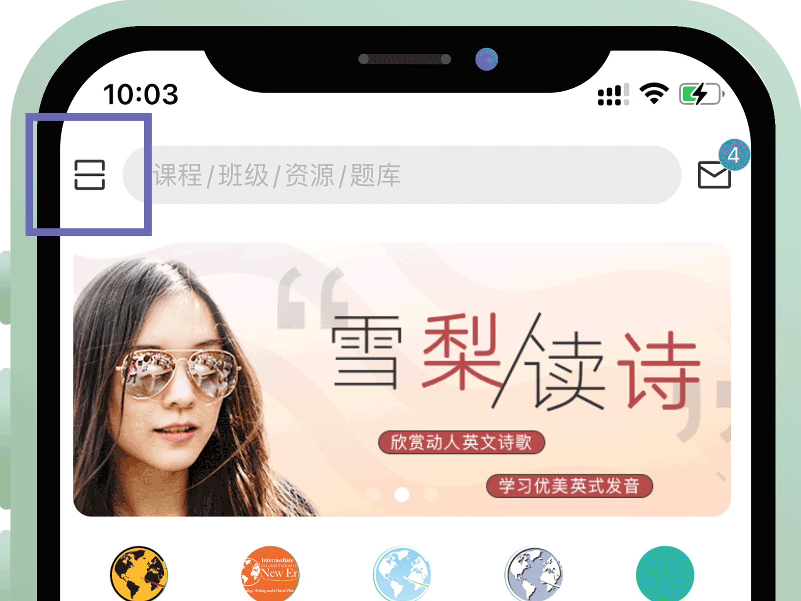
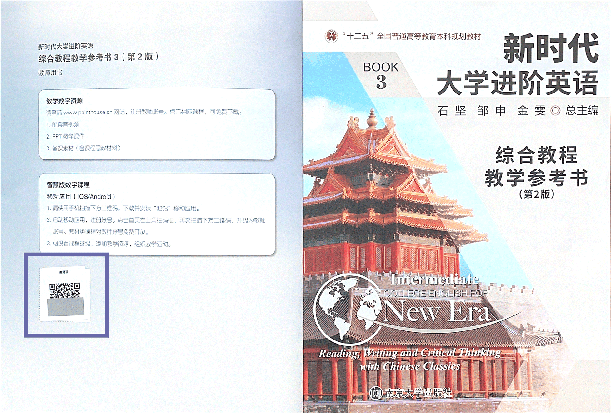
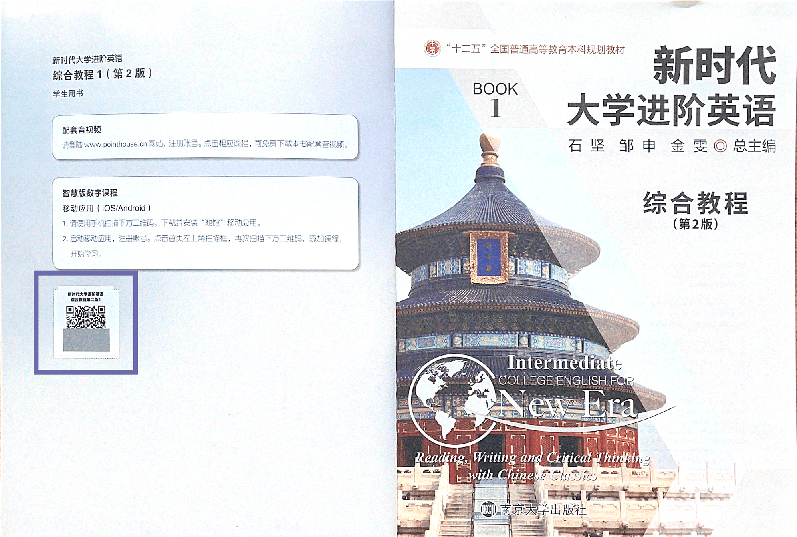

### 注册

 

* 三个注册通道：手机号、微信、Apple ID，后两种方式注册成功后，可绑定手机号📱。

* 注册成功后，所有账户均默认为学生账户。

    * 注册后可 <mark>免费领取</mark> 部分资源。如：石坚的思政课、研讨会精选

* 补全个人信息：学校、学号、姓名。尽可能如实填写，以便日后进行班级管理、发放校本材料。

 

### 升级账户

 

* 通过App首页左上角的扫描功能扫取“新时代系列教材”中任意「教学参考书」**封二**上的教师二维码即可升级为教师账户。

    

* 教师用户可查看并使用所有已上线的「数字化教材」和「题库」资源，同时获得 [班级](Digiclass) 的设置和监管权限。

* 每个教师码只能使用一次，升级成功后即作废。

### 激活资源

 

* 出于维护教学秩序的考虑，学生账户只能逐本激活所学教材的对应资源。

* 同样，通过APP首页左上角的扫描功能扫取“新时代系列教材”中「学生用书」**封二**上的二维码，即可激活对应资源。

!> 升级教师账户、激活资源权限都必须通过手机端池馆APP操作完成，网页端会随之生效。