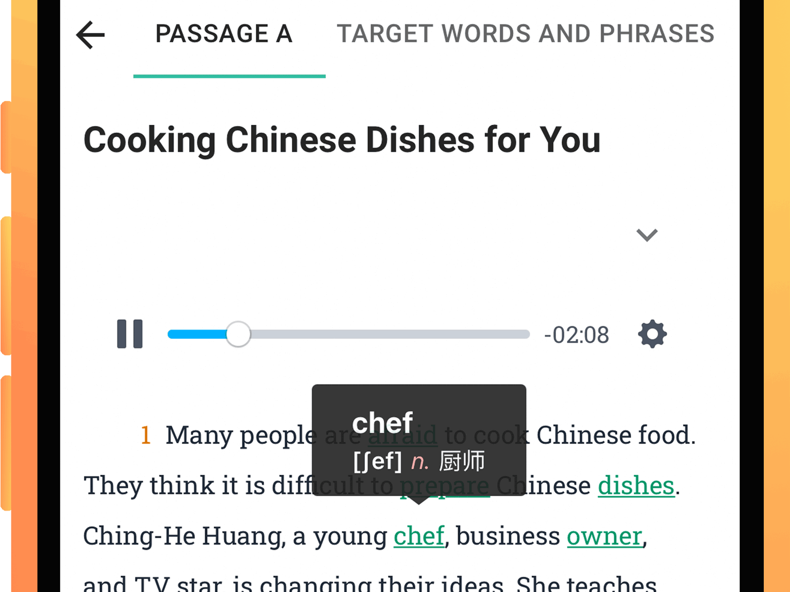
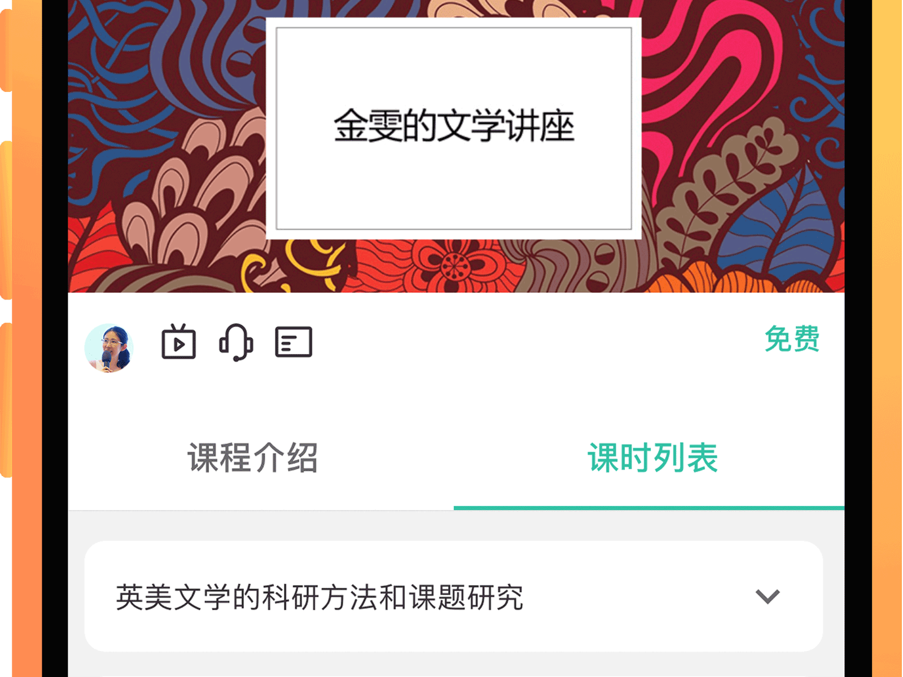
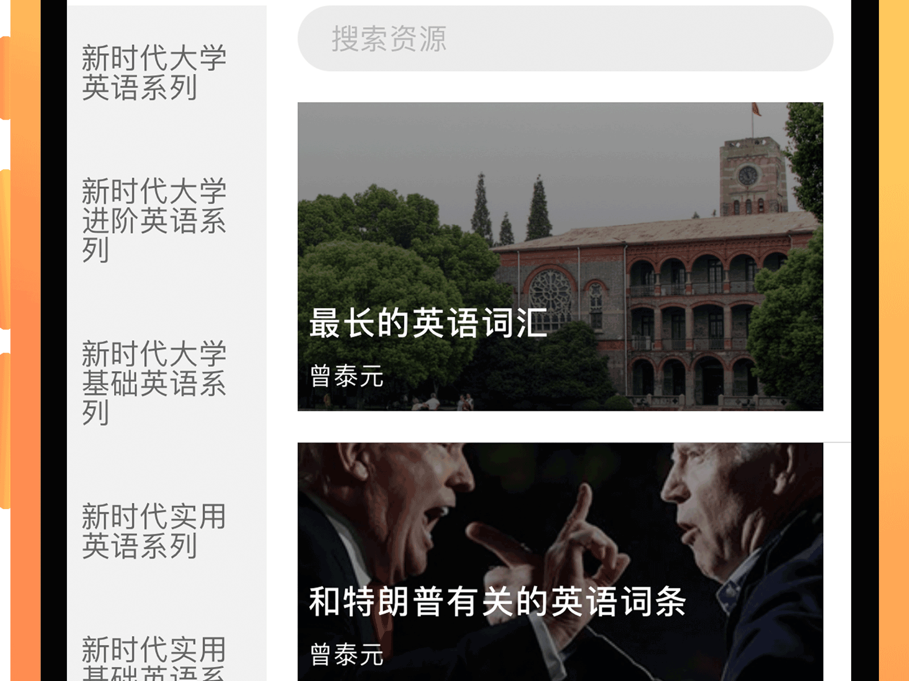
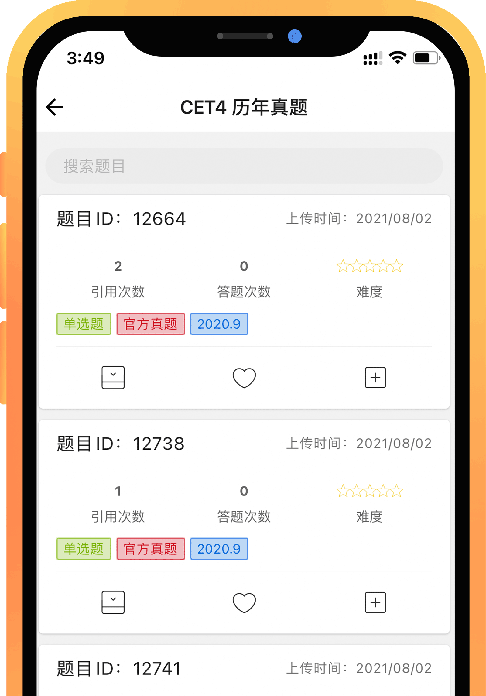

🛠 网页端暂不支持资源购买，请在移动端进行操作。

🛠 移动端和网页端可同时登陆一个账号。

### 数字化教材
📚📚📚📚📚
- 建议与纸质教材配合使用，提高学习效率。

- 「新时代大学英语」系列教材纸质出版信息汇总，可查看：[🚪](ISBN.md)

- 可通过「学生用书」**封二**的二维码扫描获取，也可用「池币」单独购买。

- 网页端功能齐全，且阅读、练习体验更好。

 

 

### 扩展课程
📚📚
- 大部分课程需用「池币」购买，部分课程免费开放给所有用户。

- 后续会上线「名师专栏」、「幕课微课私播课」，欢迎专家学者与我社业务人员联系。

 

 

### 资源库
📚📚📚 ➕ 🐝
- 面向学生的阅读资源，面向教师的备课素材（现阶段将优先发布思政性较强的素材）。

- 可将资源库中的资源通过右上角的菜单加入个人「收藏」，以备日后学习或教学使用。

- 支持创建 **校本资源库**，并向指定学校(s)师生用户开放。

 
 

 

### 题库
📚📚📚 ➕ 🐝
- 创新性地以「题型」为父分类，「考试类别」为子分类，更加符合教学逻辑。 

- 教师用户可从中选取题目在班级中发布，作为课后作业或日常训练。

- 亦可通过 [已有模版](/Digiclass?id=题库、无纸化考试) 组建 [线上无纸化考试](/Digiclass?id=题库、无纸化考试)

 

 

