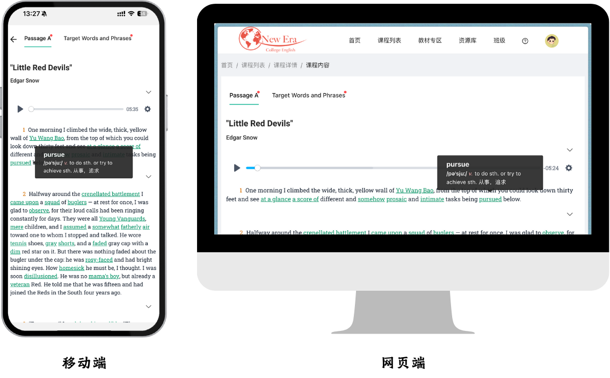
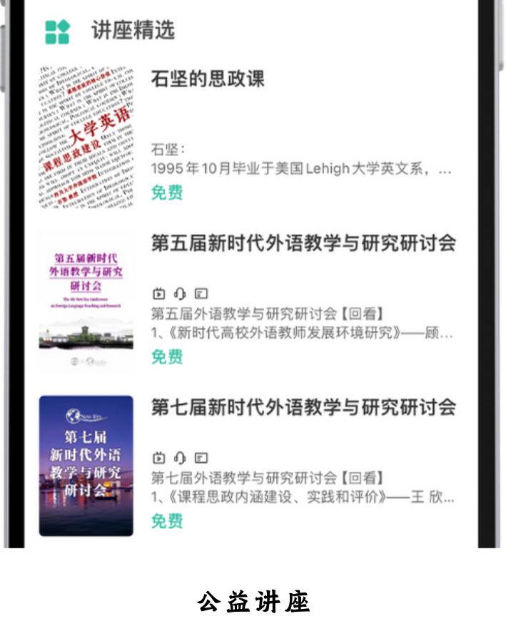
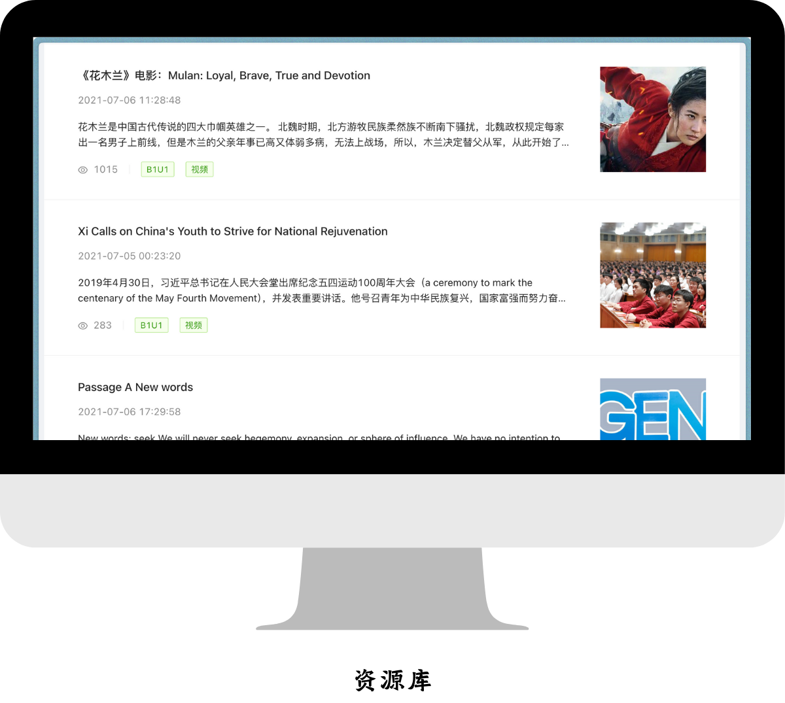

🛠 网页端暂不支持资源购买，如有需要，请移步移动端进行操作。

🛠 移动端和网页端可同时登陆同一账号。

### 数字化教材

📚📚📚📚📚

- 建议与纸质教材配合使用，提高学习效率。

- 「新时代大学英语」系列教材纸质出版信息汇总，可查看：[🚪](ISBN.md)

- 可通过「学生用书」**封二**的二维码扫描获取，也可用池币单独购买。

- 移动端灵活方便，随时随地开启学习；网页端功能齐全，阅读、练习体验或更好。

 

    

### 公益讲座与扩展课程

📚📚

- 大部分讲座免费开放给用户收看、学习，部分课程需要使用池币购买。

- 后续会上线更多「名师专栏」、「幕课、微课、私播课」，欢迎各位专家、学者、教师与我社业务人员联系。

 

    

### 资源库

📚📚 ➕ 🐝

- 面向学生的阅读资源，面向教师的备课素材（现阶段将优先发布思政性较强的素材）。

- 可将资源库中的资源通过右上角的菜单加入个人「收藏」，以备日后学习或教学使用；或直接「发送至班级」，作为班级任务发布。

- 支持创建「校本资源库」，并向指定学校师生用户开放。如有需要，请联系当地业务人员安排建设。

 

    

### 题库

📚📚📚📚 ➕ 🐝

- 二〇二三年起，题库板块重构，已涵盖主流考试的所有题型。

- 目前题库量已达 3000+，教师用户可从中选取题目在班级中发布，作为课后作业或随堂练习。

- 教师用户可自行上传题目，经编辑审核后，将转入校本题库。

- 可通过 [已有模版](/Digiclass?id=题库、无纸化考试) 随机抽取题目，快速组建 [线上无纸化考试](/Digiclass?id=题库、无纸化考试)

- 若需使用池馆系统进行高利害、大范围考试，请提前联系我社业务人员，以便定制试卷，并做好应急预案。

 

    

 

